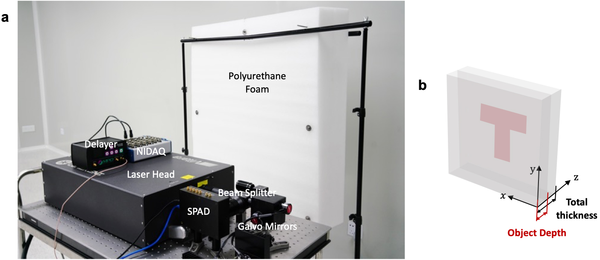
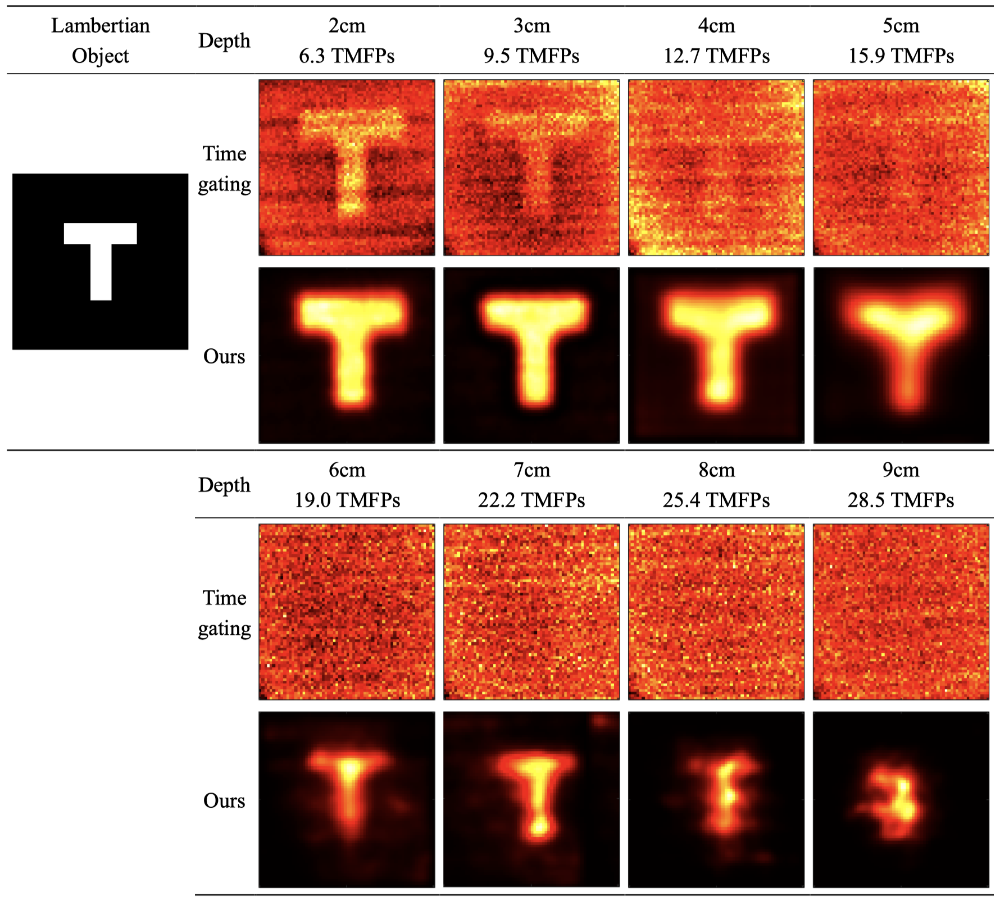

# Boundary Migration Model Code & Datasets

This repository contains data and code for the paper __[A boundary migration model for imaging within volumetric scattering media](https://www.nature.com/articles/s41467-022-30948-7)__ by Dongyu Du, Xin Jin, Rujia Deng et al. 

## Citation

If you use BMM for your research, please cite our paper:
```bibtex
@article{RF1,
   author = {Du, Dongyu and Jin, Xin and Deng, Rujia and Kang, Jinshi and Cao, Hongkun and Fan, Yihui and Li, Zhiheng and Wang, Haoqian and Ji, Xiangyang and Song, Jingyan},
   title = {A boundary migration model for imaging within volumetric scattering media},
   journal = {Nature Communications},
   volume = {13},
   number = {1},
   pages = {3234},
   ISSN = {2041-1723},
   DOI = {10.1038/s41467-022-30948-7},
   url = {https://doi.org/10.1038/s41467-022-30948-7},
   year = {2022},
   type = {Journal Article}
}
```

## Data
The provided data are all captured in the polyethylene foam scenario. The object is the Lambertian letter ‘T’ which is located at different depths from 2cm to 8cm inside the foam. As the description in the main text, the total thicknesses of the foam are 9cm to 15cm. 



## Reconstructions

The reconstructions of the proposed method are shown below (details are in the Supplementary Table 2). 




## Run
Clone the git repo,  and run `boundary_migration_model.m` in Matlab.

**Contact**  
Questions can be addressed to [Dongyu Du](mailto:dudy19@mails.tsinghua.edu.cn)
